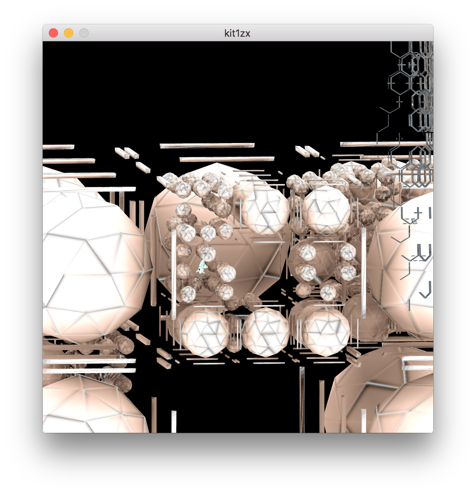
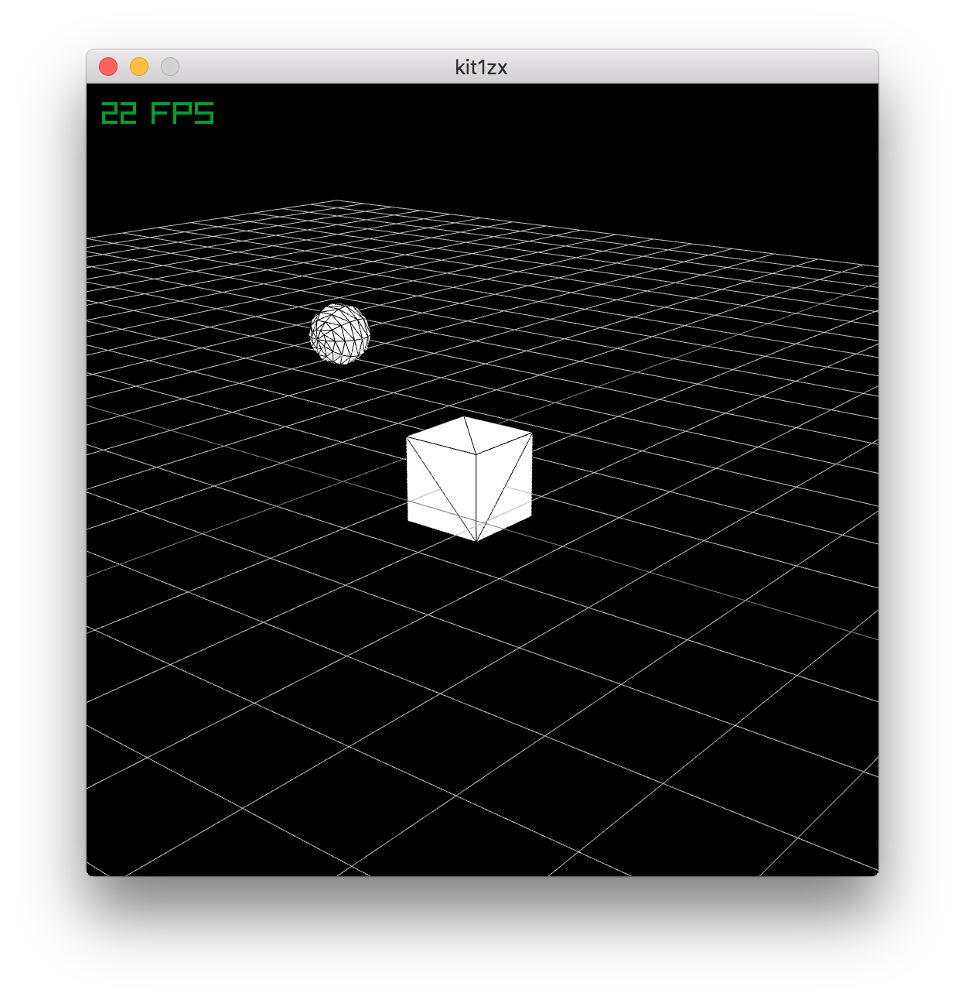

### research

https://github.com/raysan5/raylib/tree/2.0.0

https://www.flickr.com/groups/structuresynth/

https://github.com/mruby/mruby/blob/master/mrbgems/mruby-math/test/math.rb

https://github.com/mruby/mruby/blob/master/examples/mrbgems/c_and_ruby_extension_example/src/example.c

https://github.com/mruby/mruby/issues/9

https://gist.github.com/cubicdaiya/7912457

http://d.hatena.ne.jp/urekat/20120428/1335602756

https://gist.github.com/pbosetti/961cccb60cd8c21a2204

https://github.com/mruby/mruby/blob/master/include/mruby.h

https://github.com/mruby/mruby/blob/master/include/mruby/data.h

https://mrubybyexample.fazibear.me/

http://ssrb.github.io/mega-structure/mega-structure.html

https://github.com/after12am/eisenscript/tree/master/example

http://www.raylib.com/cheatsheet/cheatsheet.html

https://github.com/alChaCC/easy-box-packer

https://github.com/mruby/mruby/blob/master/mrbgems/mruby-enum-ext/mrbgem.rake

# docker 

    docker build -f Dockerfile
    docker run -p 8000:8000 kit1zx:latest rackup /var/tmp/kit1zx/config.ru -p8000 -o0.0.0.0
